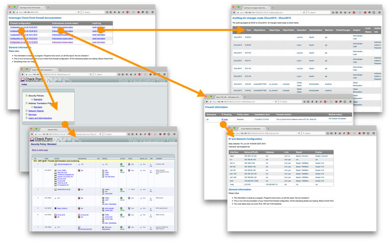
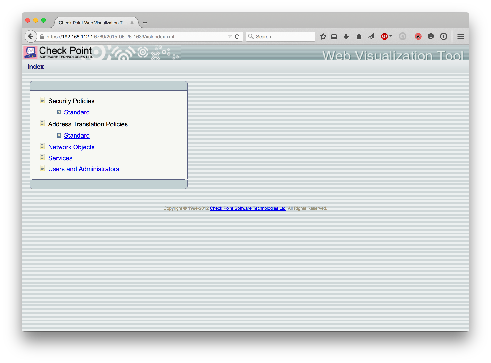
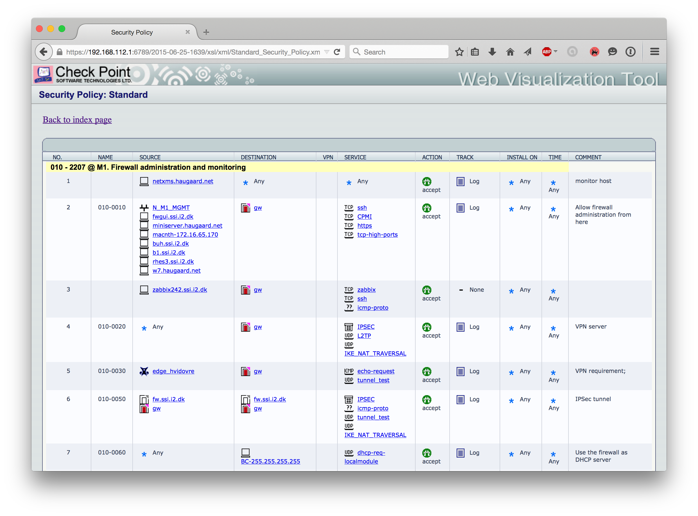
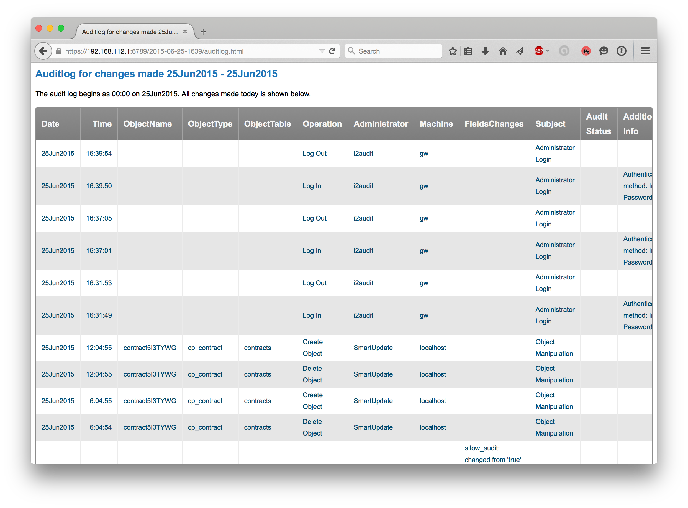

# Introduction

**UNIfw1doc** - _UNI•C FireWall-1 automated documentation tool_ - is a simple
automated firewall documentation tool for Check Point firewall-1 made by UNI•C.

**UNIfw1doc** version 1.0 is compatible with
[GAiA](http://en.wikipedia.org/wiki/Check_Point_VPN-1 ) and has been tested on
Check Point R77.10, R77.20 and R77.30, and should work with all later R77.x
versions, both appliances and open servers.

**UNIfw1doc** should be installed on the management station. It uses Check
Point's Web visualization tool (SK64501) and a number of other utilities.

**UNIfw1doc** is free software and released under a
[modified BSD License](https://opensource.org/licenses/BSD-3-Clause), see LICENSE. Using the
software requires a valid support contract with [Check Point Technologies](http://www.checkpoint.com).
**UNIfw1doc** is installed as an [rpm package](http://en.wikipedia.org/wiki/RPM_Package_Manager).

**UNIfw1doc** requires an application to render the Check Point configuration, and
works with both _cpdb2web_ from Check Point and _CPrules_. Either has to be installed
separately, as described in the installation documentation.

Check Point **cpdb2web** may be download from
[supportcenter.checkpoint.com](https://supportcenter.checkpoint.com), search
for **sk64501** and download _R77.x for Gaia / SecurePlatform / Linux_.

cpdb2web does not require a separate license, but may fail to execute if an GUI is open.

Create the directory `/var/opt/UNIfw1doc/cp_webviz_tool`, unpack the archive
there with `tar xvfpz cpdb2web*gz`.

_Notice the documentation created with cpdb2web requires Firefow for best viewing._ (not html but xml files)

**CPrules** may be downloaded from [here](http://www.wormnet.nl/download/CPRules.tar.gz)
Create the directory `/var/opt/UNIfw1doc/CPrules`, unpack CPRules.tar.gz and move all files
to `/var/opt/UNIfw1doc/CPrules`.

## How does UNIfw1doc work
**UNIfw1doc** has two components:

   * A SSL enabled Web Service (the server is part of the base operating system) for serving the documentation.
   * An application that every 15 min. test for changes to the rule base and generates new documentation, while keeping track of all past changes and versions.

Please notice that the documentation cannot be directly converted back to the firewall, and that all changes made within 15 min. is documented as one final change not a set of individual changes.

## What not to expect from **UNIfw1doc**
**UNIfw1doc** is a simple _audit tool_, visualizing information already available through the firewall GUI, while keeping track of historical changes. It is not a tool for roll-back. It processes the available information and relies on it. If you do not trust your firewall administrator **UNIfw1doc** will not help you.

## Using **UNIfw1doc**

**UNIfw1doc** is accessed though a browser with SSL on TCP port **6789** on the management station's IP address:

    https://a.b.c.d:6789

The server uses the firewall's certificate (usually a [self-signed SSL certificate](http://en.wikipedia.org/wiki/Self-signed_certificate) which will cause a browser warning).

The **main page** shows documentation for each detected change, with the newest changes at the top. Each line in the table has tree links describing how the firewall was configured at a specific point in time. 

  * The **Firewall Configuration** (first field) links to the firewall configuration (rule base etc.)
  * The **Enforcement module status** (second field) links to firewall version, IP and route info, installed rule base and installation time, while 
  * The **Audit log** (third field) shows the exported audit information.

The time stamp in the first column - Firewall configuration - links to a HTML version of the defined rule bases, with NAT, objects, users and administrators. The documentation is made with Check Point's Web Visualization Tool (see SK64501).

The rule base may look like this example.

Configuration changes are tracked in the _audit log_, and the changes between different configurations are shown - exported to a HTML table. 

The minimum audit time is one day.

The following information can usually be ignored:

  * Automatic tasks done by the firewall software, where the column Machine is localhost.
  * Automatic documentation by UNIfw1doc where the user i2audit logs in and out and column Machine is the management station.

The _firewall status_ shows hostname, policy name, installation date, firewall software version, cluster status (for check point clusters) and a link to a page with the static routing.

Example of _static routing_ on the _enforcement modules_.

## Known problems and limitations
  * The Web Visualization Tool is made by Check Point and sets the limits for what can be visualized.
  * If the servers certificate expires, changes (the path changes with major firewall upgrade) or the servers IP address changes, then the configuration for **UNIfw1doc** must be changed as well. The configuration file is ``/var/opt/UNIf1doc/etc/cp_httpd.conf``

## How to solve problems
Please contact fwsupport@i2.dk in case of problems.

## Note
UNI•C does not exist any more and the security devision has been transferred to
DEiC/i2.dk logo and images has been updated accordingly together with new
images showing cpdb2web not CPrules.

